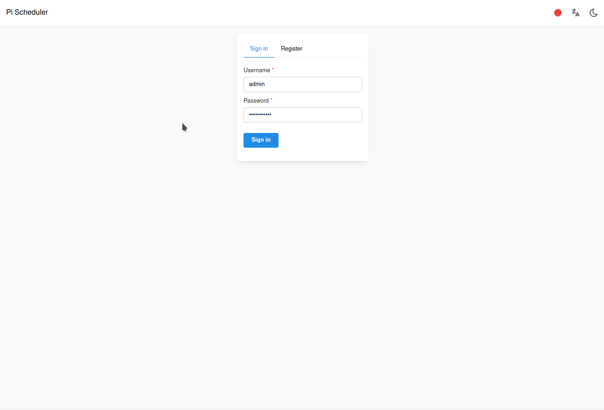
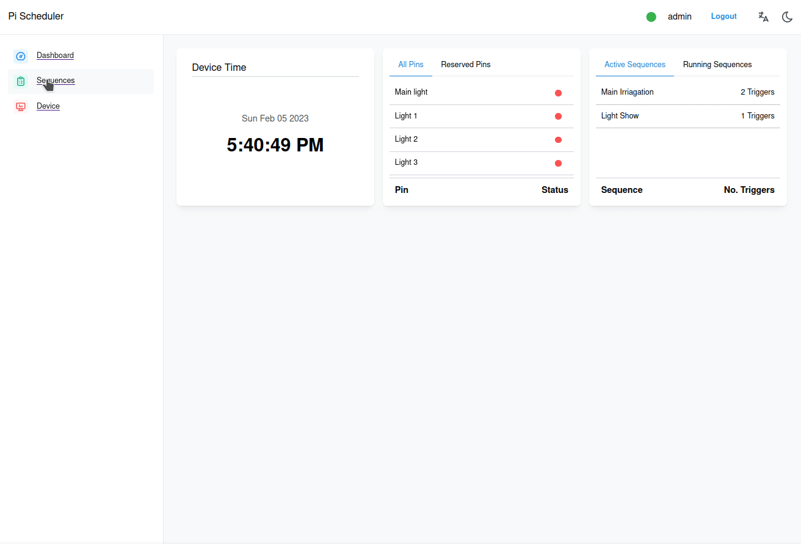
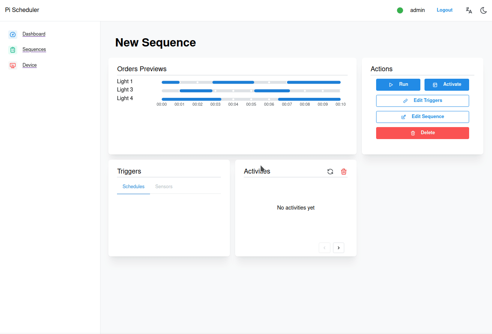
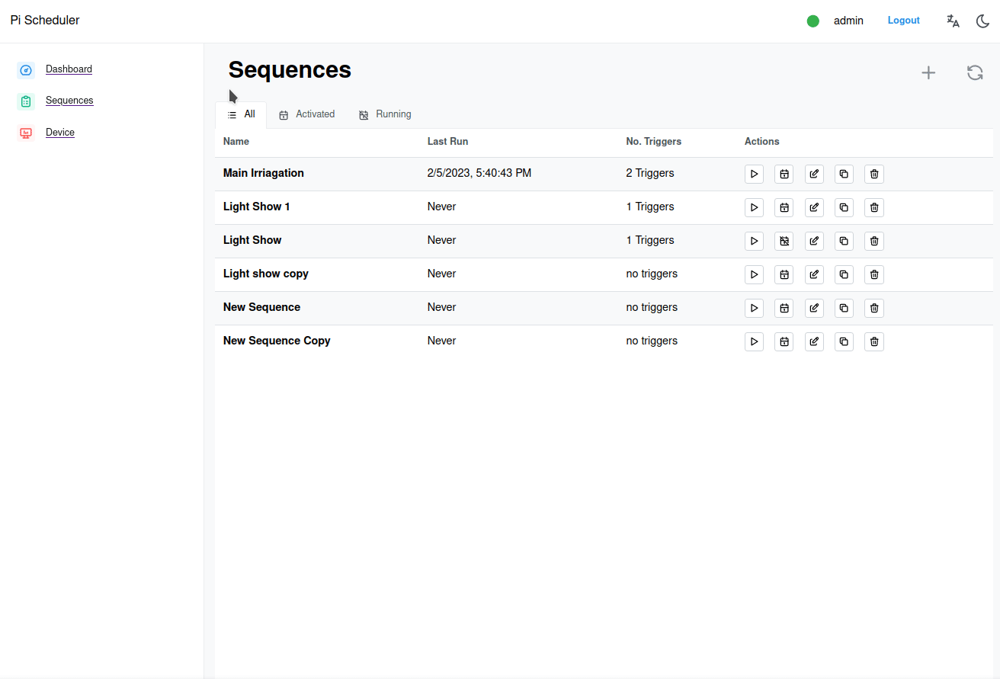
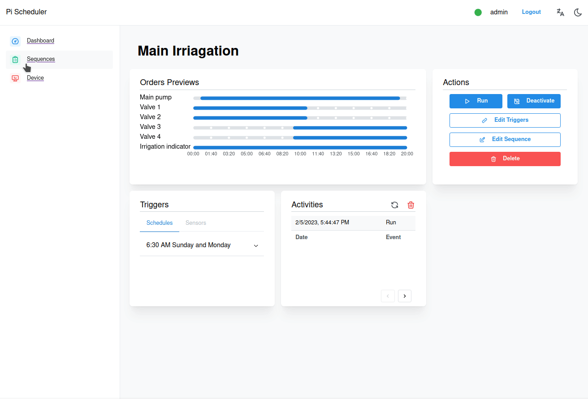
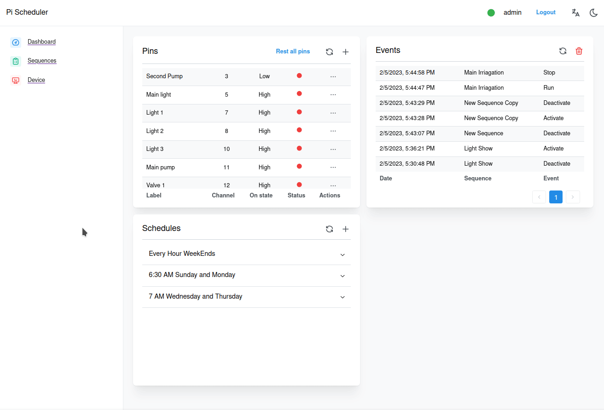
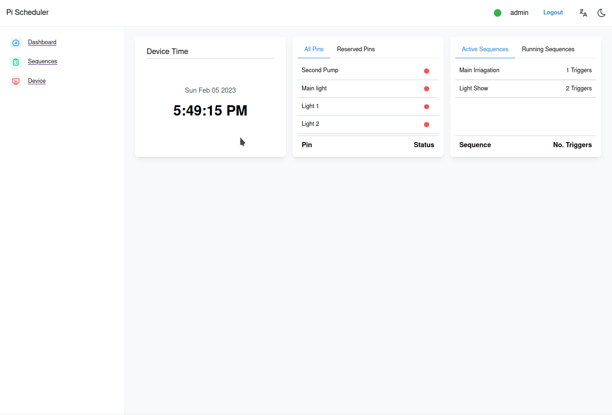
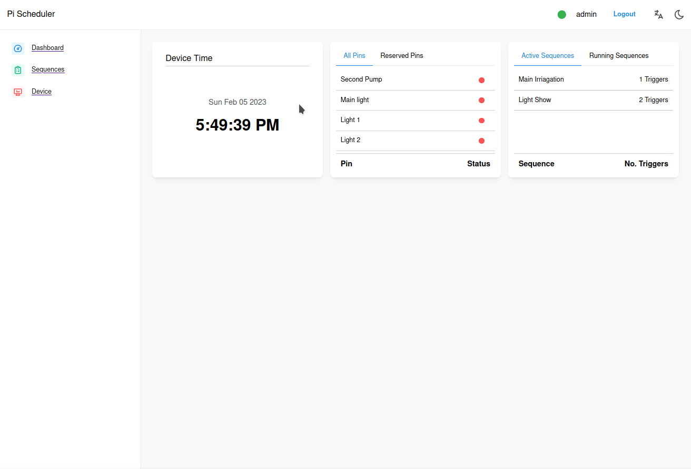
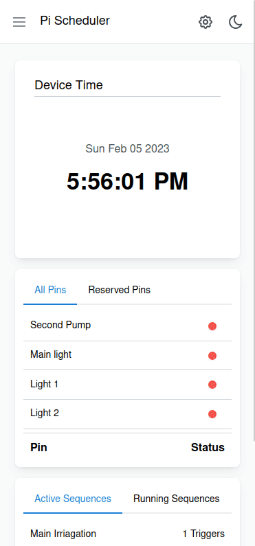

# Scheduler

## Table of content

- [Overview](#overview)
- [Screenshots](#screenshots)
- [Prerequisites](#prerequisites)
- [Installation](#installation)
  - [Pre-built image from DockerHub](#pre-built-image-from-dockerhub)
  - [Build your own image](#build-your-own-image)
  - [Stand-alone from source](#stand-alone-from-source)

## Overview

A frontend to [Scheduler](https://github.com/mohamednehad450/Scheduler), built with [NextJS](https://nextjs.org/)

## Screenshots











## Prerequisites

- Install git
  ```[Scheduler](https://github.com/mohamednehad450/Scheduler)
  sudo apt install git
  ```
- Install Docker (if not building from source)
  1. Install docker
     ```
     curl -sSL https://get.docker.com | sh
     ```
  2. Allow Docker to be used without being a root
     ```
     sudo usermod -aG docker $USER
     ```
  3. Restart
     ```
     reboot
     ```

## Installation

### Pre-built image from DockerHub

1. Create the container
   ```
   docker container create \
   --name scheduler_container \
   -v /sys:/sys \
   -p 8000:8000 \
   -e TOKEN_KEY=$(head /dev/urandom | tr -dc A-Za-z0-9 | head -c 50) \
   mohamednehad450/scheduler-frontend
   ```
2. Start the container
   ```
   docker start scheduler_container
   ```

### Build your own image

NOTE: building the image will use the pre-built image of [Scheduler](https://github.com/mohamednehad450/Scheduler)

1. Clone this project
   ```
   git clone https://github.com/mohamednehad450/Scheduler-Frontend.git
   cd Scheduler-Frontend
   ```
2. Build the image
   ```
   docker build -t scheduler-frontend .
   ```
3. Create the container
   ```
    docker container create \
   --name scheduler_container \
   -v /sys:/sys \
   -p 8000:8000 \
   -e TOKEN_KEY=$(head /dev/urandom | tr -dc A-Za-z0-9 | head -c 50) \
   scheduler-frontend
   ```
4. Start the container
   ```
   docker start scheduler_container
   ```

### Stand-alone from source

1. Install node 18 using [nvm](https://github.com/nvm-sh/nvm) or from [here](https://nodejs.org/en/download/)

2. Clone this project

   ```
   git clone https://github.com/mohamednehad450/Scheduler-Frontend.git
   cd Scheduler-Frontend
   ```

3. Install dependencies

   ```
   npm install -g pnpm
   pnpm i
   ```

4. Build the project

   ```
   pnpm run build
   ```

5. Start the server
   ```
   pnpm run start
   ```
   OR to export as a static site
   ```
   pnpm next export
   ```
